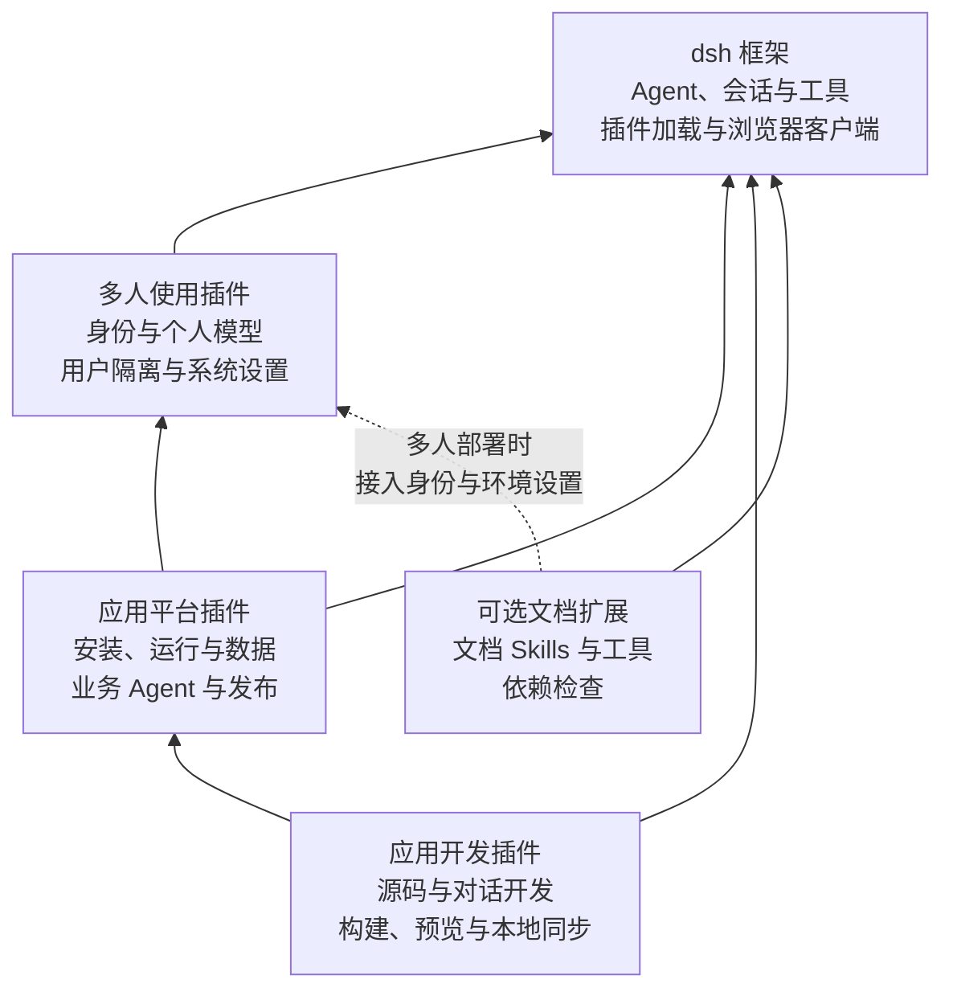
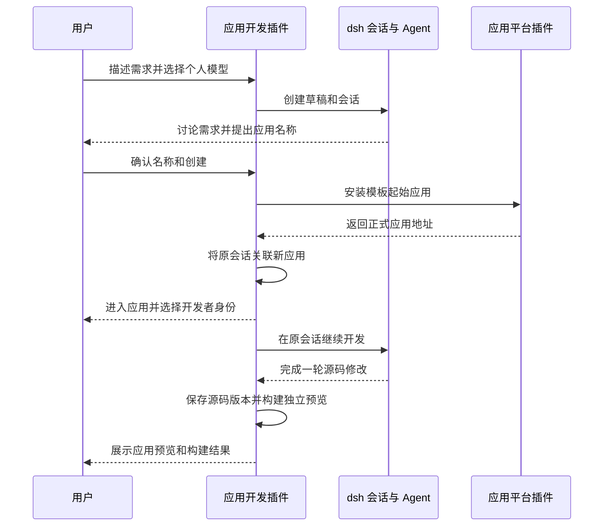
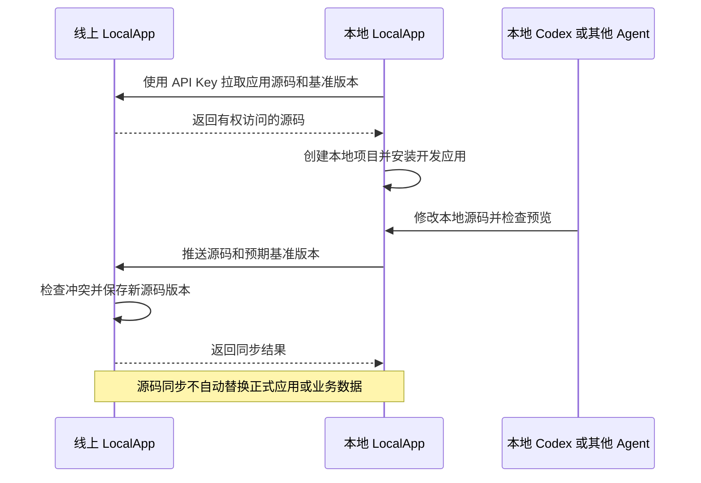

# LocalApp 拆分为 dsh 插件的方案

日期：2026 年 10 月 10 日。状态：设计方案。

LocalApp 将以 dsh 为唯一的插件运行框架、Agent 核心和浏览器客户端，提供三个主要插件：多人使用、应用平台、应用开发。每个插件提供一项完整能力，可以在适当的 dsh 组合中使用。身份、应用目录、数据库、构建和发布仍有清晰的内部模块边界，但不分别作为独立插件。

用户继续只安装 `@patodo/localapp`，使用唯一的 `localapp` CLI。前台运行、daemon、本地开发和远程部署启动同一个 Server；监听地址、数据目录和插件组合由配置决定。插件不启动各自的 HTTP 服务。

## 插件组成与依赖

下图的箭头表示消费方依赖提供方。文档处理是可选扩展，不要求安装应用平台。



| 插件 | 独立用途 | 启用后的完整体验 |
| --- | --- | --- |
| 多人使用 | 多人共用 dsh，各自使用自己的模型 | 登录、配置模型、使用原生 dsh 对话和工作区；用户之间的凭据、历史与文件隔离 |
| 应用平台 | 上传已经开发好的应用并在线使用 | 安装应用、打开正式入口、读写业务数据、使用应用 Agent、管理应用和发布版本 |
| 应用开发 | 在浏览器内创建和维护平台应用 | 讨论需求、创建应用、编辑源码、构建预览、发布；也可同步到本地使用其他 Agent 开发 |

插件独立不等于没有依赖。应用平台依赖多人使用；应用开发依赖应用平台。移除应用开发后，已安装应用仍能运行、导入新应用包和管理正式版本。

## dsh 与 LocalApp 的职责

dsh 提供插件生命周期与服务依赖、Agent 循环、模型协议、会话日志和标题、工具调用、MCP、Skills、子 Agent，以及可用的任务执行和对话组件。LocalApp 提供多用户规则、应用模型、业务数据、应用托管和应用开发流程。

服务通过 Cordis 注入；功能插件使用其他插件的公开服务，不导入其启动入口或内部实现。生命周期由注册所在的插件负责。[dsh 服务与依赖](https://github.com/deepseek-ai/deepseek-harness/blob/master/docs/cordis-tutorial/03-services.zh.md)

浏览器采用 dsh 的客户端模型、会话适配、Conversation、Chat、Trajectory 和 Slots。LocalApp 通过扩展位置增加应用页面、预览、设置和浮动入口。会话分页、重连、工具结果、执行状态和输入流程共用 dsh 的实现，不再把原始事件转换成一套自建消息列表。[dsh Web Client 架构](https://github.com/deepseek-ai/deepseek-harness/blob/master/docs/subsystems/web-client.zh.md)

定时触发、创建应用和构建发布属于服务端流程。它们复用 dsh 的执行能力，业务状态和恢复规则由所属插件保存。浏览器负责展示与交互，不能成为流程继续执行的必要条件；确实需要页面工具、用户回答或确认的步骤明确等待交互。

## 多人使用插件

多人使用插件让原生 dsh 服务可以安全地供不同用户使用，不依赖应用、应用数据库或开发项目。

| 贡献类型 | 内容 |
| --- | --- |
| 服务 | 用户和群组、浏览器登录、API Key、身份解析、角色检查、个人模型配置与凭据、通用执行环境设置 |
| 界面 | 登录、个人资料、模型供应商设置、管理员系统设置、资源和环境检查 |
| dsh 接入 | 将登录身份绑定到 RPC、订阅、会话、工作区、模型请求和工具执行；按用户解析供应商与凭据 |
| 存储 | 用户、群组、API Key、登录会话、供应商配置、加密凭据、系统环境配置；dsh 会话日志使用各用户自己的范围 |

浏览器 Cookie 和 CLI API Key 解析成同一类服务端身份。应用拥有者和同步目标用户从认证结果确定；请求中的 `ownerId`、角色或工作目录不能授予权限。每次访问资源和执行工具都验证身份与归属。

会话可以切换模型配置，模型供应商不是会话或工作区的身份。凭据只留在 Server，不能进入应用源码、提示词、日志或浏览器返回值。注销、账号停用、权限变更和凭据撤销需要覆盖已建立的连接和后续后台执行。

系统 Python 环境属于管理员配置，支持已有 venv 或创建专用 venv，供当前 Server 下所有应用的 Python 执行使用。普通用户只能看到所选能力是否可用，不能修改系统环境或读取其他用户目录。相关命令在 Server 所在机器运行；管理员环境设置不能绕过执行隔离。

### 实施前需要验证的连接接入

dsh 当前连接文档描述的是启动令牌换取浏览器会话，被接纳的请求共享同一个 operator；Host 和 Origin 检查不建立用户身份。因此，不能直接把允许远程访问的 dsh 当作已完成的多用户服务。[dsh 连接与浏览器认证](https://github.com/deepseek-ai/deepseek-harness/blob/master/packages/client/connection/README.zh.md)

第一阶段必须验证登录身份能否通过现有扩展点进入请求对应的 Peer 和会话上下文，并覆盖原生会话列表、搜索、文件、订阅和管理接口。仅在 LocalApp 新接口里检查用户不够。如果扩展点不足，应补充最小的身份接入接口，再让插件使用它；不得通过放行原有 operator 来绕开检查。

同一进程中的 Cordis Context 用于服务组织和生命周期，不是应用代码的执行隔离。Server 插件仅由管理员安装；应用脚本通过已有应用接口和隔离执行器运行。

## 应用平台插件

应用平台为已构建应用提供完整的安装和运行能力。正式入口保持 `/{owner}/{app}/`，`/serve/{owner}/{app}/` 继续只用于原始资源与 API 诊断。

| 贡献类型 | 内容 |
| --- | --- |
| 服务 | 应用目录与权限、包校验和安装、正式版本切换、应用数据库与文件、Named SQL、数据迁移、应用工具与提示词注册 |
| 界面 | 应用列表、正式应用页面、平台导航、应用设置、数据管理、业务对话入口、版本发布与恢复 |
| 工具和提示词 | 当前应用允许的业务操作和页面工具、应用上下文；由用户身份和数据权限执行 |
| 存储 | 应用元数据、配置、版本、数据库、文件、备份、Issue、通知、协作数据和应用会话关联信息 |

内部模块包括应用安装与发布、数据与文件、业务 Agent、Issue 与通知、协作、设备动作、Server 同步。它们通过内部接口组织，可按配置关闭相关功能；不为了每个页签或路由再新增插件。

应用 SDK 保留 `useRegisterTools()`、系统提示词注册、Named SQL 和文件等接入方式。能力可用范围由系统设置、应用声明、当前用户选择、当前身份以及依赖状态共同决定；工具调用时再次检查。关闭工具后，直接请求该工具也必须被拒绝。

业务会话按用户、应用和会话保存。应用平台提供用户身份的对话；开发插件通过扩展点增加开发者身份。历史菜单中的身份选择切换对应会话列表，普通用户不会获得开发入口。开发者切换回用户身份后使用正式应用及业务权限，不能携带开发工具权限。

平台导航继续按应用操作在左、用户操作在右组织。应用页面和开发预览中的脚本必须与平台管理能力隔离；页面工具只通过校验后的接口和消息调用平台，不能获得 dsh 原生文件、会话管理或插件安装权限。

### 正式数据与发布

已有每应用 SQLite 数据库、SQL migration、Named SQL 和记录权限继续由平台提供。dsh 的通用领域存储目前没有跨表事务和自动数据迁移，可用于适合的辅助记录，不能直接替代现有应用数据库。[dsh 领域存储说明](https://github.com/deepseek-ai/deepseek-harness/blob/master/packages/storage/storage-domain/README.zh.md)

平台接收应用包，检查认证身份、应用权限、包内容、兼容性、摘要、目标当前版本和迁移条件，然后通过同一安装流程发布。在线构建生成的包和外部 CLI 上传的包使用这个入口。外部包的安装检查不代表源码测试已经通过。

发布请求按应用串行处理，检查预期版本并处理重复请求。发布记录保存包摘要和可选的源码、构建来源引用；应用平台不需要查询开发插件内部表即可安装包。源码恢复、代码版本回退和业务数据恢复保持三个不同操作，切换旧代码不自动撤销数据迁移。

CRDT 认证、持久化和传输仍由平台承担。Awareness 只保存短期在线状态，不进入备份或 Server 数据同步；编辑位置遮罩继续由应用声明的属性决定，并且不拦截应用交互。

## 应用开发插件

应用开发在应用平台之上提供完整源码开发能力，业务应用不需要额外搭建后端或维护自己的 Agent 服务。

| 贡献类型 | 内容 |
| --- | --- |
| 服务 | 创建草稿、应用命名、源码与工作区、源码历史、开发会话、构建检查、独立预览、源码上传下载和 pull/push |
| 界面 | 创建应用对话、应用内开发者入口、文件与改动、构建日志、预览、源码同步和迁移入口 |
| 工具和提示词 | 应用开发预设、模板规范、源码编辑工具、构建和预览工具、真实诊断反馈；发布前由用户查看结果 |
| 存储 | 创建草稿、项目、源码版本、工作区、附件、构建输入与产物、日志、预览数据和服务端流程状态 |

业务 Agent 和开发 Agent 共用当前用户的模型配置，使用不同的上下文和历史。开发 Agent 的文件、终端、MCP、Skills、子 Agent 和后台任务仅在对应项目范围内可用；运行位置和环境由 Server 配置决定。

### 对话创建和继续开发



确认名称前是草稿，不出现在正式应用列表；确认后模板可以立即打开。原会话和工作区继续使用，重复确认或重连不能创建第二个应用。已有模板页面不代表需求已经实现。

创建、会话关联、构建和结果反馈由服务端保存步骤及操作标识。刷新或关闭页面后，服务端能够继续无需浏览器的步骤；重连后恢复实际进度。Server 重启时，将无法继续的执行标为中断，依据已保存结果恢复，不能盲目重复安装、发布或数据写入。

### 构建和预览

每次构建使用固定源码版本，后续编辑不会改变构建输入。复用已有项目检查和打包逻辑，记录工具链版本、检查结果和产物摘要。

快速预览只承担编译和预览所需检查，不能显示为完整测试通过或直接用于发布。正式发布前执行完整检查。构建失败的真实日志反馈到原会话，自动修复次数有上限，并由服务端记录；浏览器关闭不会丢失该流程。

Agent 可以准备源码和构建；发布与正式数据恢复由用户明确触发。普通 Agent 工具调用不能直接进入应用安装或数据恢复接口。

预览的数据库、文件、访问凭据与正式数据分开。草稿脚本在隔离的预览页面执行，不接收平台登录凭据；预览请求不能调用管理或发布接口。无法提供必要执行隔离的环境显示不可用，不能退回普通子进程执行。

### 本地开发和旧应用迁移



用户在本机启动同一个 LocalApp Server，拉取线上源码，本地目录交给 Codex 或其他工具开发。完成后通过 LocalApp 推送源码，线上构建并由用户发布。线上源码发生变化时报告冲突，不静默覆盖。API Key 确定目标端用户和权限，不需要额外指定拥有者。

旧应用可以继续作为已安装包运行。需要在线编辑或源码同步时，再通过迁移 Skill 上传原始项目、检查应用归属并关联源码。迁移不能从 `dist` 猜测源码，不能用模板覆盖旧应用；排除依赖目录、构建产物和凭据。源码同步与显式的业务数据库、文件同步保持分开。

### 对话界面

保留已确定的底部浮动输入、显式放大缩小、最小化、执行状态和完成消息气泡。点击输入框、发送消息或切换历史不会自行展开；输入框左侧加号用于附件，标题显示 Agent 命名的会话名称，身份选择位于历史菜单中。

浮动入口和开发页面共用 dsh 的会话组件与状态。文件、改动、日志和预览通过扩展位置展示，不另建 Studio 导航入口。LocalApp 新增的菜单、表单、设置和弹窗使用 shadcn/ui，图标使用 Lucide。

## 文档扩展和共享代码

PDF、DOCX、XLSX 和 MarkItDown 的公共 Skills 继续供用户和应用选用。只有说明和脚本的内容直接作为 Skills 包；需要工具、依赖检测和界面注册时，由可选文档扩展贡献。普通 dsh 文档任务也能使用，不依赖应用目录或应用开发。

多人部署时，文档扩展接入多人使用插件的身份与通用 Python 环境，声明所需依赖及检查结果。应用平台根据检查结果阻止启用不可用 Skill；工具执行时也验证状态。文档扩展不创建另一套系统 Python 配置，不将文件发送到额外云服务。

SDK、公共类型、文件辅助代码和数据库辅助代码作为职责明确的普通库保留。各插件负责自己的表、迁移、数据目录和后台任务。跨插件通过公开服务或类型交互，不通过共享全局变量、内部表或直接构造其他插件的服务实例交互。

## 包结构和默认组合

建议的内部目录如下；包名与公开入口在打包验证阶段确定，尚不是可用安装命令。

```text
packages/
  localapp/                   唯一公开 npm 发行包、CLI、daemon、默认组合
  dsh-multiuser/               多人使用插件的 Host 和 Client 入口
  dsh-app-platform/            应用平台插件的 Host 和 Client 入口
  dsh-app-development/         应用开发插件的 Host 和 Client 入口
  dsh-document-tools/          可选文档扩展
  sdk-core/                   应用 SDK
  sdk-react/                  React SDK
  sdk-agent/                  应用工具和提示词注册 SDK
  crdt/                       应用可选协作 SDK
init-repo/                    模板与应用开发 Skills
```

三个主要插件分别构建、声明依赖并提供配对的服务端和浏览器贡献。唯一发行包包含插件与所需 dsh 依赖，提供可选择的插件入口，使已有 dsh 组合也能加载所需能力，不要求用户安装另一套 CLI。插件入口解析、浏览器依赖发现和静态资源需通过真实发行包测试。

| 组合 | 插件 | 适用场景 |
| --- | --- | --- |
| 多人 dsh | 多人使用 | 多用户对话和工作区，无应用托管 |
| 应用运行 | 多人使用、应用平台 | 安装外部应用包并运行，可关闭在线开发 |
| 完整 LocalApp | 三个主要插件，按需启用文档扩展 | 在线开发、本地源码同步和应用运行 |

`localapp` 默认使用完整组合。管理员在 Server 配置中选择组合；用户和应用只能在已提供且允许的能力中选择，不能通过设置页安装任意 Server 插件。

最终由 dsh 的 HTTP 承载插件路由、原生 API 和静态资源。迁移期间可在同一个 HTTP Server 内适配旧 Fastify handler，不另开端口或代理到第二套后端。适配层仅用于保持已有 URL 和 SDK，迁移完成后移除旧集中组装代码。

卸载前检查依赖和运行任务。禁用开发插件会关闭新的开发入口，保留正式应用、源码和历史；活动任务需完成或明确取消再释放。释放服务、路由、工具、订阅、前端注册项和子进程不等于删除数据，数据删除仍走明确的管理操作。

## 迁移步骤

当前仓库固定的 dsh 依赖为 `0.2.1-alpha.1`。实施时选择当时最新且完成兼容验证的版本，固定整组 Host 和 Client 依赖及对应资料，记录插件支持的版本范围。升级不能只替换包版本而继续使用旧事件和 UI 适配。

| 阶段 | 工作 | 完成条件 |
| --- | --- | --- |
| 1 身份与组合验证 | 验证 dsh 连接身份接入、个人供应商、原生会话与文件隔离；验证唯一发行包能加载 Host 和 Client 插件 | 两个用户同时使用 dsh，互不可读凭据、会话和文件；未认证的原生接口也被拒绝 |
| 2 多人使用与客户端 | 提取认证、用户模型、管理员环境配置；接入完整 dsh 对话客户端 | 不安装应用平台时，登录、模型配置、原生对话和工作区可完整使用 |
| 3 应用平台 | 迁移应用安装、数据、正式入口、业务 Agent 和平台设置；保留 SDK 与 URL 适配 | 不安装开发插件时，已有应用可读写、使用 Agent、安装新包及管理正式版本 |
| 4 应用开发 | 迁移源码、创建草稿、开发会话、构建预览与 pull/push；将流程状态移到服务端 | 创建到发布的完整路径通过，关闭浏览器后的构建结果可以恢复 |
| 5 存量升级与收尾 | 迁移数据和历史、接入文档扩展、整理默认组合；移除旧启动和会话实现 | 真实 npm 包安装与升级通过，旧应用及会话可访问，三种组合分别通过验收 |

每一阶段迁移对应模块的数据并保留恢复路径，最后一阶段验证完整存量升级。通过该阶段的兼容与权限验收后，才将对应入口切换到新插件。

现有 `packages/server/src/server.ts` 的集中服务和路由注册按三个插件迁移；`deepseek-harness.mts` 的手动组装逐步由插件贡献取代；现有 Web 页面迁入各 Client 入口；开发模块归应用开发，安装和数据逻辑归应用平台。

数据迁移覆盖用户、加密凭据、应用数据库与文件、源码、会话关联和日志。升级前保存可恢复备份，逐项记录迁移完成状态，失败不覆盖原数据。旧会话按原用户、应用和供应商映射到新关联；无法完整转换的日志保留可读历史，不伪造工具成功状态。保留旧数据不等于允许旧服务与新服务同时写入；运行中断、升级与恢复步骤需在同一 Server 中执行。

本方案不直接修改当前行为规格。实施时为插件组合、多用户原生接口、对话创建、业务与开发身份、后台恢复、源码同步和发布补充 OpenSpec 场景；源码工作按 RED → GREEN → REFACTOR 执行，并维护逐场景的集成与 E2E 对照。

## 验收范围

| 场景 | 必须验证的行为 |
| --- | --- |
| 多人 dsh 独立运行 | 不加载应用平台和开发插件，仍能配置模型、对话、使用工作区 |
| 原生接口隔离 | 两用户的会话列表、搜索、分页、文件、订阅和工具结果互不串用；直接调用接口不能绕过检查 |
| 个人模型 | 各用户请求自己的供应商；会话切换模型后继续原历史；撤销凭据后的后台请求不能继续使用旧凭据 |
| 应用平台独立运行 | 不加载开发插件，安装外部应用包、从正式入口读写业务数据、调用业务工具并管理版本 |
| 身份切换 | 拥有者在历史菜单中选择用户或开发者；历史分开；非拥有者不能伪造开发请求 |
| 创建与继续开发 | 名称确认后应用立即可打开，原会话关联新应用并继续；重复确认只创建一次 |
| dsh 对话与浮动入口 | 原生历史、工具状态、停止、问题回答及重连正确；最小化和展开行为符合已确定交互 |
| 后台构建与恢复 | 关闭页面不丢失构建状态；失败日志回到原会话；Server 重启不会重复安装或发布 |
| 预览与正式数据 | 预览只能读写预览数据和文件，无法调用管理或发布接口；失败不替换当前成功预览 |
| 发布 | 仅发布选定产物；版本竞争与重复请求正确处理；快速预览不能冒充完整发布检查 |
| 本地源码同步 | API Key 确定身份；pull/push 保留二进制源码资产并检查基准冲突；默认不替换正式业务数据 |
| 旧应用与历史升级 | 未上传源码的应用继续运行；上传源码后可开发；账号、凭据、正式数据和原会话得到保留 |
| 环境与公共 Skills | 普通用户不能修改系统环境；缺少依赖时前端和服务端均阻止启用，运行时再次检查 |
| 插件禁用与发行 | 依赖缺失可诊断；关闭开发不影响应用运行；发行包离线包含所需资源，无第二套 Server |

端到端验证的项目、Server 数据、上传下载和截图放在本仓库 `tmp/` 的明确目录。应用功能从 Server 返回的 `/{owner}/{app}/` 正式入口验收；源码静态检查或 `/serve/` 调用不能替代完整用户路径。
