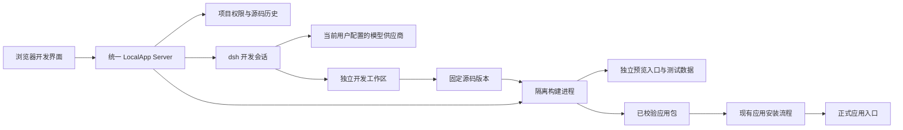

# 平台内应用开发方案

## 1. 目标与范围

开发者打开 LocalApp 网页，创建应用、描述需求或编辑源码，检查 Agent 改动、构建测试、预览，最后发布到正式应用。无需在自己的电脑安装 Node、管理目录或运行终端。所有命令发生在统一 Server 所在机器；Server 部署在开发者本机时仍是本机执行，部署在远程时浏览器即可工作。

第一阶段支持单开发者、builtin 模板、React/Vite 与 Named SQL 应用。从创建到发布必须完整可用。后续实现源码 ZIP 导入导出、多人独立工作区和可选外部 Git 同步。平台内开发不增加 hosted JavaScript backend，不恢复独立 Desktop、托盘或第二套 Server。

## 2. 当前可复用能力与缺口

| 当前源码 | 可复用内容 | 需要改变的部分 |
| --- | --- | --- |
| server/src/lib/deepseek-harness.mts | 模型适配、会话、事件、取消 | 将会话数据目录和项目工作目录分开传入 |
| server/src/lib/deepseek-capabilities.mts | 文件、搜索、终端、Skills、后台任务、子 Agent | 显式配置开发工作目录；保留对其他 Server 数据的隔离 |
| server/src/routes/agent.ts | 用户模型、权限检查、SSE | 增加项目开发入口；开发目录不使用用户/应用/供应商哈希 |
| localapp/src/project/check.ts、package.ts | 项目检查、构建、打包 | 抽取内部共用模块，命令运行使用 Server 的隔离执行器 |
| server/src/lib/app-installer.ts | 包安装、版本切换、migration、回滚 | 从已验证构建记录发布，继续使用既有安装流程 |
| web 与 sdk-agent | shadcn/ui、对话与工具事件 | 开发工作台、项目文件接口、构建与预览操作 |

当前 .localapp 包只允许 manifest、dist 和声明的后端等运行文件，不能从已安装包还原完整源码。已有应用只有导入源码并验证应用身份后才能关联开发项目。

## 3. 整体结构



Server 管理目录、权限、操作状态和发布。dsh 负责修改工作区与执行开发任务，不直接读写正式应用目录、项目历史、发布记录或用户凭据。浏览器提交 projectId、workspaceId、buildId 等标识，不提交 Server 路径或任意代理目标。

## 4. 项目、工作区和源码历史

项目独立于已发布应用存在，首次发布前也可以开发。项目关联一个 ownerId 与 appName，发布目标不能通过编辑 manifest 改为其他用户的应用。

建议目录：

```text
dataDir/development/projects/<projectId>/
  history.git/                       # Server 维护的 Git 历史
  workspaces/<workspaceId>/files/     # 编辑器与 Agent 共用源码、依赖和临时输出
  sessions/<userId>/<sessionId>/     # dsh 会话；不向构建进程开放
  snapshots/<snapshotId>/            # 固定源码输入
  builds/<buildId>/                  # 日志、检查结果、应用包、产物摘要
  previews/<previewId>/              # 独立数据库、文件及应用版本
```

项目元数据写入平台 SQLite：Project、ProjectMember、Workspace、SourceVersion、DevelopmentSession、Build、Preview、Release。外键、操作状态和资源大小均由 Server 维护。Git 只用作源码版本存储；用户不用输入 Git 命令。第一阶段用 npm 包内的 Git 实现完成内部历史，构建镜像需包含依赖；外部 Git CLI 和远程账户接入留到后续，避免要求开发者自行安装。

工作区由项目与开发会话确定，模型仅是会话配置。切换供应商复用同一工作区，模型调用记录仍记录供应商；换供应商期间先停止当前模型请求再启动新请求。

源码文件默认纳入历史；.git、node_modules、缓存、dist、日志、会话、.env 和明确排除的密钥文件不进入源码版本与导出包。平台凭据从不写入工作区；导入文件需路径、符号链接、大小和敏感文件检查。源码本身可能包含误写的秘密，导出与发布前给出检测结果并阻止已识别的凭据进入产物，不声称排除列表能发现所有秘密。

创建工作区、开始 Agent 修改和恢复版本前自动保存源码版本。构建时暂停源码写入，保存版本并复制固定输入，然后释放写入锁；后续编辑不改变正在构建的内容。恢复创建新源码版本，保留历史，不自动改变正式应用或正式数据。

第一阶段每个工作区只允许一个写入者：Agent 写入期间编辑器只读，停止 Agent 及其子任务后才恢复编辑；第二个浏览器可查看，写入须取得有到期时间的写入锁。文件保存还必须提交内容摘要，旧内容返回 409，禁止覆盖新内容。锁由 Server 维护，断线宽限后释放，Server 重启恢复为可编辑且保留改动。多人阶段每人使用独立工作区，向项目主版本提交改动，展示冲突并由用户解决；源码协作暂不引入 CRDT。

## 5. 权限与开发 Agent

| 项目角色 | 查看源码、日志、预览 | 编辑与运行开发 Agent | 发布 | 管理成员与删除项目 |
| --- | --- | --- | --- | --- |
| 查看者 | 是 | 否 | 否 | 否 |
| 开发者 | 是 | 是 | 否 | 否 |
| 发布者 | 是 | 是 | 是 | 否 |
| 所有者 | 是 | 是 | 是 | 是 |

第一阶段只有所有者，角色结构预留。应用访问权限不代表源码访问权限；管理员可控制系统资源与停用开发能力，不默认获得项目源码查看权。关联现有应用与发布还需验证现有应用的所有权；多人角色不能绕过当前安装流程的 owner 检查。

开发 Agent 独立于业务应用 Agent。复用用户自己的模型供应商，不共享 API key；开发项目设置分别控制工具、Skills、MCP、子 Agent 和后台任务。系统资源检查不满足时阻止启用相关能力。开发上下文提供模板 AGENTS.md、LocalApp 开发 Skills、平台版本、当前文件与构建诊断。应用源码里的提示词只能影响该开发任务，不能授予平台权限。

开发工具增加 platform_check、platform_build、platform_preview，参数仅引用当前项目与工作区。用户设置和请求上下文决定权限，不能接受模型给出的 ownerId。发布使用界面的 Server API；Agent 可以准备构建并提示用户查看，不能自己调用安装 API或得到发布凭据。原有 Agent 权限、隔离和供应商设置保持独立。

## 6. 开发与构建执行环境

管理员系统设置增加“应用开发环境”：检查 Node、包管理器、平台模板/SDK、隔离执行支持和磁盘，展示队列、时限与额度。已有 Python 环境继续供开发脚本共用，不把 Node 依赖装入 Python 环境。

不直接在 Server 主进程中执行项目脚本；复用隔离执行组件，增加专门的构建配置。构建只能写自己的构建目录，读取固定源码、工具链与该任务依赖，不能读取 Server 会话、其他项目或正式数据。缓存只作为加速，不能把其他项目的任意文件挂载给任务。子进程环境使用白名单，HOME/TMPDIR/包管理器缓存均位于任务目录。

必须先验证不同平台的实际边界，现有 dsh 文件沙箱不能直接视为完整的多用户构建隔离：依赖安装会执行脚本，现有终端网络与 CPU/内存限制也需补齐。初始实现优先 Linux 隔离构建，验证进程树取消、磁盘/输出限制、并发上限、网络出口和系统文件访问。管理员选择支持的构建方式；未达到所需隔离的平台只展示环境不可用及原因，不能无提示退回普通 spawn。构建 worker 可以是 Server 启动和回收的子进程或容器，不新增独立后端服务。

依赖安装允许访问配置的公开 registry，私网、回环和云元数据地址不允许访问；开发 Agent 网络也不能绕过相同边界访问正式 Server。必要私有 registry 后续通过专门的短期凭据方案支持，第一阶段不开放。固定 lockfile；安装脚本默认禁用，确有需要的模板依赖需由平台明确列出并在隔离任务内执行，不允许模型临时扩大权限。记录 Node、包管理器、模板和平台 SDK 版本，以便复现。

每个构建基于固定 SourceVersion 执行：安装依赖 → 项目/能力/migration/Named SQL 检查 → 测试 → 构建 → dist 检查 → 打包与应用包校验。复用已有 check/package 逻辑，不把 HTTP 请求套成带平台 API key 的 CLI。发布所需阶段必须通过，不能通过改 package.json 去掉必要检查。无项目测试时明确报告，没有测试不显示“测试通过”。

Build 状态：queued、running、succeeded、failed、cancelled、interrupted。任务重启后标 interrupted，可重新构建，不误报成功。日志通过可恢复游标 SSE 展示，限量保存和过滤凭据；取消回收整个进程树。构建失败不改变当前预览和正式应用。

## 7. 预览与数据隔离

第一阶段使用构建产物预览，先不引入常驻 Vite/HMR。每次成功构建创建可预览版本，预览界面保持正式 Platform Shell 行为，Named SQL、migration、文件和应用 Agent 使用独立的 previewId 数据范围。预览默认只有模板/测试数据，不复制生产数据；后续复制必须单独授权、记录范围，不开放随意访问正式数据的选项。

预览数据库与文件通过同一 Server 的应用运行组件访问，所有路径根据 Server 已验证的 previewId 查找。SDK 使用专门预览 API 基址；请求中即使伪造正式 appId 也不能访问正式数据。平台通知、设备动作、对等同步和其他具有外部副作用的能力默认关闭，界面明确显示测试模式。

草稿 JavaScript 不能与平台管理界面共用 origin，否则可能访问用户管理会话。预览使用独立 hostname/origin，由同一个 Server 监听或部署反向代理指向同一 Server；不是第二套应用后端。平台登录 Cookie 仅绑定平台主机，预览不接收它。开发页通过一次性短期 ticket 创建范围仅为 previewId 的 HttpOnly 预览会话，ticket 使用后失效且不持久保存在 URL。跨 origin 消息检查 origin、来源窗口和固定消息类型。

iframe 的 CSP/sandbox、平台 Cookie、跨站请求及预览 API 必须一起验证；不能只用路径隔离。API 对跨 origin 的写操作校验来源，预览 origin 的请求不能调用管理/发布接口。远程部署需要预览域名与 TLS；本机配置不同 hostname。无法提供独立 origin 时关闭可执行预览，保留构建结果展示。预览会话与对象到期后回收，保留构建包和日志按额度管理。

## 8. 发布与恢复

用户在界面选中成功的 buildId，看到应用名称、源码版本、改动、检查结果、数据结构变化，然后点击发布。Server 重新检查用户与目标应用权限、包摘要、平台兼容性，以及构建仍属于当前项目。发布的是该构建固定源码的包，即使当前编辑器已有后续修改；界面显示差异。

每个目标应用串行发布，要求请求带预期当前应用版本，重复请求使用幂等键，旧版本竞争返回 409。复用 installAppPackage 的安装、migration、维护锁和错误处理，不直接修改正式版本目录。发布记录关联 sourceVersion、buildId、包摘要、正式版本、发布人和结果。发布失败保留构建和诊断，正式数据状态按照既有 installer 结果展示，包括需要修复 migration 的情况。

源码恢复、应用版本回滚、正式数据库/文件恢复是三个不同操作。应用回滚继续使用当前回滚机制与兼容性检查；不把切换旧代码描述成自动撤销数据迁移。涉及数据恢复时展示备份和现有维护流程，不能由开发 Agent自行执行。

## 9. 界面与接口

入口：个人工作台增加“开发项目”；应用设置中有权限时展示“开发”，跳转关联项目。平台 Shell 应用操作放左侧，用户入口放右侧。

开发页直接使用 dsh 的 AppFrame、SidebarRoot、EmptyHero 源码和原版对话、消息、输入区样式。左侧是可折叠的项目与会话列表，中间是 Agent 对话，右侧是可拖动调整宽度的源码、改动和构建面板。输入区选择当前用户的模型，顶部提供源码、构建、预览和发布操作。窄屏自动折叠侧栏。LocalApp 接入自身项目 API、源码编辑器和输入状态；不另启 dsh 后端。用户主要通过自然语言开发，工具执行详情可展开查看。

应用正式页面还提供拥有者专用的底部开发对话：收起时是浮动输入条，执行时展开对话与工具记录，并提供停止按钮。它使用同一个开发项目、模型设置、源码版本、构建和发布接口。应用操作仍留在平台 Shell 左侧，底部对话不替代应用自己的业务 Agent。

已有应用按拥有者与应用名查找开发项目。安装包没有原项目源码时，用户选择原项目目录导入，平台验证应用名、文件数量和大小；不从编译产物猜测源码，也不新建模板覆盖原应用。导入过滤依赖、构建产物和凭据文件；当前源码快照仍只支持 UTF-8 文本，遇到二进制资产明确报错。只有拥有者可以访问或导入该源码，预览页不展示开发对话。改动后需要重新构建，上线只发布选中的成功构建，并检查正式版本是否已改变。

建议 API 前缀 `/api/development/projects`：

| 接口 | 用途 |
| --- | --- |
| POST /、GET / | 创建、列出有权限的项目 |
| GET /:id、PATCH /:id | 项目详情与配置 |
| GET /:id/files、GET/PUT /:id/file | 文件列表、读取、带内容摘要的保存 |
| POST /:id/workspaces | 创建独立工作区 |
| GET /:id/versions、POST /:id/restore | 源码历史、恢复为新版本 |
| POST /:id/agent/run、POST /:id/agent/cancel | 开发 Agent 操作，复用已有事件组件 |
| GET /:id/events | Agent、文件变更、构建事件；带游标 |
| POST /:id/builds、GET /:id/builds/:buildId | 创建构建、结果与日志 |
| POST /:id/builds/:buildId/cancel | 取消任务和进程树 |
| POST /:id/previews | 为成功构建创建独立预览 |
| POST /:id/releases | 发布固定构建，带目标版本和幂等键 |
| POST /:id/import、GET /:id/export | 后续源码导入导出 |

每个接口检查项目角色、所属对象和版本；文件接口使用相对路径，拒绝路径穿越、符号链接逃逸与内部目录。文件变化由 Server 跟踪后推送，客户端事件不是源码版本依据。Agent 运行中的细粒度文件变化可以批量通知，停止时重新扫描确保与实际目录一致。

## 10. 交付阶段

1. 项目基础、权限与环境：模板创建、源码历史、文件 API、系统检查与隔离构建验证。
2. 浏览器开发：编辑器、改动、dsh 项目会话、锁与恢复、用户模型切换。
3. 第一阶段闭环：固定输入构建、独立预览、显式发布、失败诊断和正式入口 E2E。前三项完成才算可用功能，不以“能聊天改文件”作为交付。
4. 可移植源码：ZIP 导入导出、已有应用关联、源码备份与恢复。
5. 多人开发：项目角色、独立工作区、改动合并与冲突；可选外部 Git 同步，凭据只归当前用户。

## 11. 验收与风险

全部本地项目、Server 数据、构建、上传下载放在本仓库 tmp/。使用 builtin 模板创建测试应用；验证预览后发布，并从正式 /<owner>/<app>/ 入口验证读写和权限，不以 /serve/ 为验收入口。

重点失败场景：切换模型丢目录、旧页面覆盖文件、取消后子进程残留、Server 重启误报成功、符号链接读取其他项目、草稿访问正式 Cookie/API、依赖脚本读取凭据、构建期间编辑导致发布内容变化、migration 失败和并发重复发布。测试通过才开放对应能力。

源码包含商业数据，需要独立的项目备份/导出方案。备份包括源码历史、项目关系与发布来源，不包含 node_modules/缓存，不以现有正式应用数据备份替代源码备份。删除项目先停止任务，允许先导出；不默认删除正式应用。资源回收不得删除正在预览或已关联发布的必要记录。

实现前需要完成两个技术验证：Linux 隔离构建与依赖安装的实际权限；独立 origin 下 Platform Shell、SDK、登录和 Named SQL 预览的兼容性。这些是实现任务，不能直接沿用现有沙箱测试作为通过证据。


## 当前实现与目标方案的差异

当前代码是可测试的第一版，未完成第一阶段全部验收。源码历史暂用 SQLite 内容快照，未实现内部 Git；构建暂读取管理员准备的模板依赖，未开放 registry 安装。开发页面移入 dsh 的布局、侧栏和欢迎页源码，沿用原版对话与输入区样式及发布的 UI primitives；项目操作接入 LocalApp API，没有启动另一套 dsh 后端。开发 Agent 暂开放文件、Skills 和离线终端，项目级能力设置、MCP、子 Agent 与后台任务尚未开放。

实际 macOS 检查能够阻止文件与网络越界，但完整 builtin 模板中的本地网络测试失败。Linux 网络隔离、完整资源额度和回收尚待验证或实施。上述内容是待完成项，不改变前文要求；详情及已验证结果见 verification.md。
